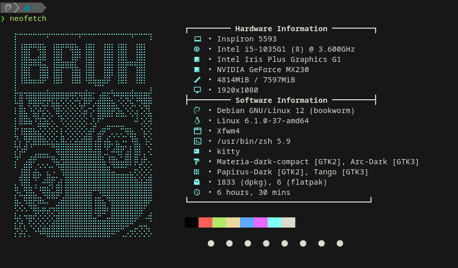

# ✨ Neofetch Config – Custom Themed Setup by ibraheem

This repo contains a **custom `neofetch` configuration** file with personalized styling and ASCII art.

It displays system information in a clean, icon-rich layout using **Nerd Fonts**, along with a custom ASCII logo loaded from a separate file.

---

## 📸 Preview



---

## 📁 Structure

neofetch-config/
├── config.conf # Main Neofetch config
├── ascii.txt # Custom ASCII art logo
└── screenshot.png # Preview image

---

## 🔧 Features

- 🖥️ **Hardware Info** (CPU, GPU, RAM, Resolution...)
- 💻 **Software Info** (Distro, Kernel, WM, Shell, Terminal...)
- 🎨 **Custom ASCII Art** from `ascii.txt`
- 🚀 **Nerd Font Icons** for a visual touch
- 🧼 Clean sections with line separators and minimal noise
- 📦 Package manager count + system theme/icons

---

## 🛠️ How to Use

1. Clone the repo:

```bash
git clone https://github.com/mobx2/neofetch-config.git


2. Backup your current config (optional):
cp ~/.config/neofetch/config.conf ~/.config/neofetch/config.backup

3. Copy the config and ASCII art:
cp neofetch-config/config.conf ~/.config/neofetch/
cp neofetch-config/ascii.txt ~/.config/neofetch/

4. neofetch

Requirements

    neofetch installed

    Terminal that supports Nerd Fonts

    Set a Nerd Font in your terminal settings (e.g., JetBrains Mono Nerd Font, FiraCode Nerd Font, etc.)


```
